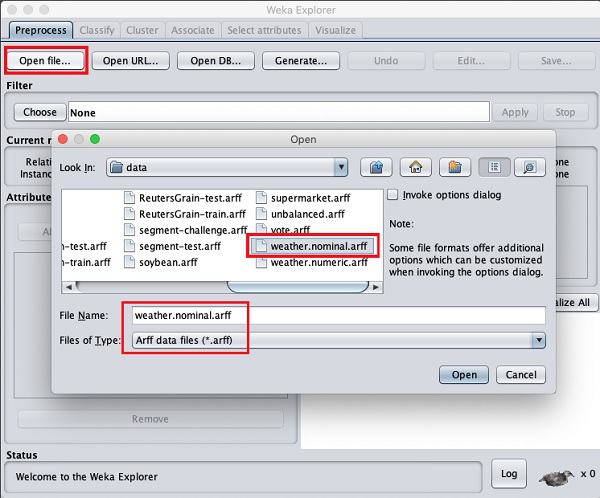

# Lab 01: Data Preprocessing and Data exploration

## 1. Purpose

- Hands-on exploring data through the application of support tools provided by the open-source
    software WEKA.
- Hands-on preprocessing data in Python.

## 2. Overview

- Maximum 2 members/group.
- Duration: 2 weeks (see details on Moodle).
- The submission folder’s is MSSV1 MSSV2 , including the following contents:
    * A lab report with format PDF. The first page contains the group information, the contribu-
       tion rate of each member, and the questions or requirements that have not been completed.
    * Source code: Put all in sub-folderSource, including relevant source code files in the pro-
       gramming part. Language: Python 3
- Finally, compress the MSSV1 MSSV2 folder into azipformat and submit it on Moodle.

## 3 Detail description

### 3.1 Install WEKA (0.5 points)

- Download WEKA fromhttps://waikato.github.io/weka-wiki/downloading_weka/(Note:
    In the experimental process with Weka, if you have an out-of-memory error, please refer to the fol-
    lowing link to solve:https://waikato.github.io/weka-wiki/faqs/OutOfMemoryException/
- WEKA can be used in three ways – via the GUI, a Java API, and a command line interface.
    The GUI has three components Explorer, Experimenter, and Knowledge Flow, apart from a
    simple command line interface. In this lab, students will use the Explorer function to perform
    explore data. (Note: If you are interested in API, you can refer to the tutorial in this link
    https://www.youtube.com/watch?v=q3Gf6kqaJWA)
- **Requirement 1**:After installing, you capture a screen that contains the ”Explorer” function
    in your desktop background.
- **Requirement 2**:Students open any data set (with extended part .arff). Explain the meaning of
    Current Relation,Attributes, andSelected AttributeinPreprocesstag. Briefly explain
    the meaning of the other tags in WEKA Explorer.
- Note:WEKA installation comes up with many sample databases for you to experiment with.
    These are available in the data folder of the WEKA installation.


```
Figure 1: Example about loading available data sets
```
### 3.2 Getting Acquainted With WEKA (4.5 points)

In this section, you will explore some data sets, such as breastcancer.arff, weather.numeric.arff, credit-
g.arff by WEKA software. And answer some questions about these.

   3.2.1 Exploring Breast Cancer data set
   First, you will load the data file namelybreastcancer.arffinto the WEKA explorer. After successful,
   let’s look at the Explorer site to answer questions or perform requirements in the followings:

   - How many instances does this data set have?
   - How many attributes does this data set have?
   - Which attribute is used for the label? Can it be changed? How?
   - What is the meaning of each attribute?
   - Let’s investigate the missing value status in each attribute and describe in general ways to solve
      the problem of missing values.
   - Let’s propose solutions to the problem of missing values in the specific attribute.
   - Let’s explain the meaning of the chart in the WEKA Explorer. Setting the title for it and
      describing its legend.
   Note: Youmustcapture the screen of each step and/or add some comments in this image to
   illustrate.

   3.2.2 Exploring Weather data set
   Second, you will load the data file namelyweather.numeric.arffinto the WEKA explorer. After
   successful, let’s look at the Explorer site to answer questions or perform requirements in the followings:

   - How many attributes does this data set have? How many samples? Which attributes have data
      type categorical? Which attributes have a data type that is numerical? Which attribute is used
      for the label?


   - Let’s listfive-number summaryof two attributestemperatureandhumidity. Does WEKA
      provide these values?
   - Let’s explain the meaning of all charts in the WEKA Explorer. Setting the title for it and
      describing its legend.
   - Let’s move to the Visualize tag. What’s the name of this chart? Do you think there are any
      pairs of different attributes that have correlated?

   3.2.3 Exploring Credit in Germany data set
   Similarly, you will also load the data file namelycredit-g.arff into the WEKA explorer. After
   successful, let’s look at the Explorer site to answer questions or perform requirements in the followings:

   - What is the content of the comments section incredit-g.arff(when opened with any text editor)
      about? How many samples does the data set have? How many attributes? Describe any five
      attributes (must have both discrete and continuous attributes).
   - Which attribute is used for the label?
   - Let’s describe the distribution of continuous attributes? (Left skewed or right skewed ?)
   - Let’s explain the meaning of all charts in the WEKA Explorer. Setting the title for it and
      describing its legend.
   - Let’s move to the Select attributes tag. Describe all of the options for attribute selection.
   - Which options should be used to select the 5 attributes with the highest correlation?(Step-by-step
      description, with step-by-step photos and final results)

### 3.3 Preprocessing Data in Python (5 points)

The program must have the following functions (0.5 points for each function):

1. Extract columns with missing values
2. Count the number of lines with missing data.
3. Fill in the missing value using mean, median (for numeric properties) and mode (for the cate-
    gorical attribute).
4. Deleting rows containing more than a particular number of missing values (Example: delete rows
    with the number of missing values is more than 50% of the number of attributes).
5. Deleting columns containing more than a particular number of missing values (Example: delete
    columns with the number of missing values is more than 50% of the number of samples).
6. Delete duplicate samples.
7. Normalize a numeric attribute using min-max and Z-score methods.
8. Performing addition, subtraction, multiplication, and division between two numerical attributes.
    Command line arguments are defined by yourself. Suggested example:
    First function:
       python3 list-missing.py data.csv

```
Third function:
python3 impute.py data.csv --method=mean --columns length price --out=result.csv
```

When your program is ready, let’s test them withhouse-prices.csvdata set. Specifically, you will
test each function in this data set with various cases (For example: filling in missing values for many
attributes) (1 point)
**Important Note:**

- **Students can use the library to read CSV files and process the command line argu-
    ments. All the rest must install themselves.**
- **Clean code will be given a bonus of 1 point.**

## 4 Reference

1. Lecture slides
2.https://www.cs.waikato.ac.nz/ml/weka/
3. Textbook: J. Han and M. Kamber: Data Mining, Concepts, and Techniques, Second Edition -
    Chapter 2: Data Preprocessing.
4. Textbook: I. H. Witten and E. Frank: Data mining, Practical Machine Learning Tools and
    Techniques.

## 5 Contact

- Teacher: Nguyen Thi Thu Hang
- Email: ntthuhang0131@gmail.com


